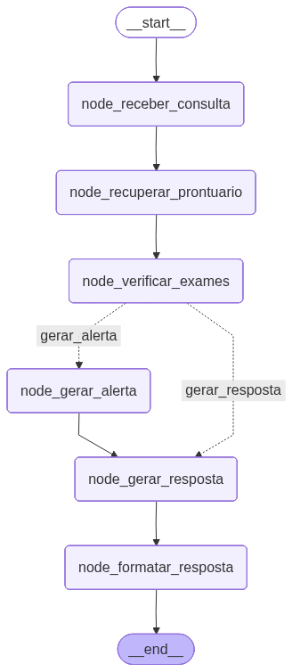
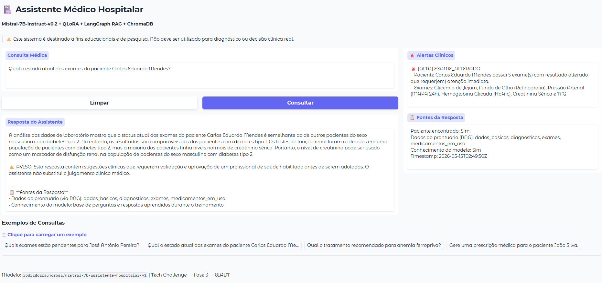

# Relatório Técnico — Tech Challenge Fase 3
## Assistente Virtual Médico Hospitalar com Fine-Tuning, RAG e LangGraph

**Curso:** FIAP AI para DEVs (8IADT)  
**Grupo:** 49  
**Integrantes:**
- Rodrigo de Araújo Rosa
- Elias Maximiano da Silva
- Fábia Gomes de Jesus
- Danilo Pereira

**Data:** Maio de 2026

---

## 1. Introdução

Este relatório documenta o desenvolvimento do Tech Challenge — Fase 3, cujo objetivo é construir um **Assistente Virtual Médico Hospitalar** capaz de auxiliar médicos em condutas clínicas, responder dúvidas sobre pacientes e sugerir procedimentos com base em prontuários e conhecimento biomédico.

A solução integra três tecnologias complementares: um modelo de linguagem de grande escala (LLM) fine-tunado em dados médicos em português brasileiro, um pipeline de Recuperação Aumentada por Geração (RAG) sobre prontuários de pacientes, e um grafo de decisão orquestrado com LangGraph.

> ⚠️ **Uso exclusivamente acadêmico.** Este sistema não deve ser utilizado para diagnóstico, prescrição ou qualquer conduta clínica em pacientes reais.

### 1.1 Objetivo

Desenvolver um assistente virtual que:

1. Responda perguntas clínicas em português brasileiro com base em conhecimento biomédico fine-tunado
2. Recupere e contextualize informações de prontuários de pacientes via RAG
3. Detecte e alerte sobre exames pendentes ou com resultados alterados
4. Recuse automaticamente solicitações de prescrição médica
5. Registre todas as interações em log de auditoria estruturado

### 1.2 Entregáveis do Projeto

| Entregável | Link |
|:---|:---|
| Este Relatório | `docs/TECHNICAL_REPORT_FASE3.md` |
| Repositório | [github.com/rodrigoaraujorosa/fiap-ia-devs-8iadt-fase3-tech-challenge](https://github.com/rodrigoaraujorosa/fiap-ia-devs-8iadt-fase3-tech-challenge) |
| Modelo Fine-Tunado | [huggingface.co/rodrigoaraujorosa/mistral-7b-assistente-hospitalar-v1](https://huggingface.co/rodrigoaraujorosa/mistral-7b-assistente-hospitalar-v1) |
| Demo Assistente Hospitalar | [huggingface.co/spaces/rodrigoaraujorosa/assistente-hospitalar-techchallenge-8iadt](https://huggingface.co/spaces/rodrigoaraujorosa/assistente-hospitalar-techchallenge-8iadt) |
| Notebook 01 — Preprocessamento | `notebooks/01.PreProcessamento_DataSet_TC_Fase3_8IADT.ipynb` |
| Notebook 02 — Fine-Tuning | `notebooks/02.Fine-Tuning_TC_Fase3_8IADT.ipynb` |
| Notebook 03 — Pipeline RAG LangGraph | `notebooks/03.LangGraph_RAG_Pipeline_TC_Fase3_8IADT.ipynb` |
| Comparativo de Inferência | `docs/comparativo_inferencia_mistral.xlsx` |
| Vídeo | `link do video` |

### 1.3 Dataset de Treinamento

| Item | Descrição |
|:---|:---|
| Dataset original | PubMedQA — subconjunto PQA-A (`ori_pqaa.json`, 509 MB) |
| Fonte | [pubmedqa.github.io](https://pubmedqa.github.io/) |
| Instâncias | 211.269 pares QA biomédicos gerados artificialmente |
| Idioma original | Inglês |
| Idioma alvo | Português Brasileiro |
| Formato de saída | Alpaca (`instruction` / `input` / `output`) |
| Arquivo gerado | `data/preprocessed/train_data.json` |

### 1.4 Base de Prontuários

| Item | Descrição |
|:---|:---|
| Arquivo | `data/prontuarios.json` |
| Registros | 20 pacientes fictícios |
| Geração | Sintética por IA, sem dados reais de pacientes |
| Idioma | Português Brasileiro |
| Condições cobertas | 20+ condições clínicas (HAS, DM2, IAM, AVC, sepse, DPOC, etc.) |
| Status de exames | `pendente`, `concluido`, `alterado`, `cancelado` |

### 1.5 Dados do Projeto

Esta seção apresenta um resumo dos dados utilizados no projeto. Para a documentação completa — incluindo processo de geração dos prontuários, limitações de uso, critérios de reprodutibilidade e instruções detalhadas para obtenção do dataset original — consulte o **[Anexo A — README da pasta data](#anexo-a--readme-da-pasta-data)** ao final deste relatório.

#### Dataset de Treinamento: PubMedQA (PQA-A)

O fine-tuning foi realizado com o subconjunto **PQA-A** do dataset **PubMedQA**, composto por 211.269 pares de perguntas e respostas biomédicas gerados artificialmente a partir de abstracts do PubMed, originalmente em inglês.

O arquivo `ori_pqaa.json` (509 MB) não está incluído no repositório por exceder o limite do GitHub. Após o preprocessamento pelo Notebook 01, o resultado é salvo em `data/preprocessed/train_data.json` no formato Alpaca.

Limitações relevantes do dataset:
- Instâncias geradas artificialmente — não revisadas por especialistas clínicos
- Idioma original inglês, com tradução automática que pode introduzir imprecisões
- Escopo de pesquisa biomédica (yes/no/maybe), não de assistência clínica direta
- Conhecimento médico datado de 2019

#### Dicionário de Termos Médicos (`medical_dict.json`)

Arquivo de pós-processamento com **131 termos clínicos** mapeados de inglês para português brasileiro, aplicado após a tradução automática para corrigir terminologia crítica. Cobre cardiologia, pneumologia, nefrologia, endocrinologia, hematologia, neurologia, gastroenterologia, infectologia e procedimentos diagnósticos.

#### Prontuários Fictícios (`prontuarios.json`)

Base de **20 prontuários inteiramente sintéticos**, gerados por IA para fins acadêmicos. Nenhum dado real de paciente foi utilizado. Os registros foram elaborados com:

- **Alinhamento semântico** com o dataset de treinamento — condições clínicas compatíveis com as categorias do PQA-A
- **Estrutura clínica realista** — valores laboratoriais, diagnósticos e medicamentos clinicamente coerentes
- **Cobertura completa de status de exame** — `pendente`, `concluido`, `alterado` e `cancelado`, para testar todos os fluxos do grafo LangGraph
- **Dados totalmente fictícios** — nomes, datas e identificadores gerados aleatoriamente

> ⚠️ **Restrição de uso:** proibido utilizar estes dados para diagnóstico, prescrição ou qualquer conduta clínica em pacientes reais. Uso restrito a fins acadêmicos e de pesquisa.

---

## 2. Arquitetura Geral do Sistema

O sistema é composto por três pipelines sequenciais e independentes, cada um implementado em um notebook Google Colab:

```
[PubMedQA EN] ──► [Notebook 01: Preprocessamento] ──► [train_data.json PT-BR]
                                                               │
                                                               ▼
                                              [Notebook 02: Fine-Tuning QLoRA]
                                                               │
                                                               ▼
                                              [HuggingFace Hub: LoRA Adapter]
                                                               │
                                              [prontuarios.json] ──► [ChromaDB]
                                                               │         │
                                                               ▼         ▼
                                              [Notebook 03: LangGraph RAG Pipeline]
                                                               │
                                                               ▼
                                                    [Interface Gradio]
```

### 2.1 Componentes Principais

| Componente | Tecnologia | Versão |
|:---|:---|:---|
| Modelo LLM base | `mistralai/Mistral-7B-Instruct-v0.2` | — |
| Adaptador LoRA | `rodrigoaraujorosa/mistral-7b-assistente-hospitalar-v1` | v1 |
| Técnica de fine-tuning | QLoRA (PEFT + TRL SFTTrainer) | PEFT 0.19.1 / TRL 1.4.0 |
| Quantização | 4-bit NF4 + double quantization | bitsandbytes 0.49.2 |
| Modelo de tradução | `Helsinki-NLP/opus-mt-tc-big-en-pt` | — |
| Vector Store (RAG) | ChromaDB persistido no Google Drive | — |
| Embeddings | `paraphrase-multilingual-MiniLM-L12-v2` | sentence-transformers |
| Orquestração | LangChain + LangGraph | langchain 0.3.7 / langgraph 0.2.45 |
| Interface | Gradio | — |
| Infraestrutura | Google Colab (GPU T4 / L4) | — |
| Logging de auditoria | JSON Lines | — |

### 2.2 Grafo de Decisão LangGraph

O fluxo de uma consulta é modelado como um **grafo de estados** com 9 nós e arestas condicionais explícitas:

```
START
  │
  ▼
[detectar_prescricao]
  │
  ├─(prescrição)─────────────────────────► [recusar_prescricao]
  │                                                  │
  └─(ok)                                             │
       ▼                                             │
[identificar_paciente]                               │
  │                                                  │
  ├─(encontrado)──► [rag_paciente]                   │
  │                      │                           │
  │               [buscar_alertas]                   │
  │                      │                           │
  └─(genérico)──────► [rag_generico]                 │
                          │                          │
                          ▼                          │
                    [invocar_llm]                    │
                          │                          │
                          ▼                          │
                  [formatar_resposta] ◄──────────────┘
                          │
                   [registrar_log]
                          │
                         END
```

**Descrição dos nós:**

| Nó | Responsabilidade |
|:---|:---|
| `detectar_prescricao` | Verifica se a consulta solicita prescrição médica direta |
| `recusar_prescricao` | Retorna recusa imediata sem acionar a LLM |
| `identificar_paciente` | Fuzzy-match do nome do paciente na query |
| `rag_paciente` | RAG filtrado por `patient_id` — recupera chunks do prontuário no ChromaDB |
| `buscar_alertas` | Exames pendentes/alterados via metadados do ChromaDB |
| `rag_generico` | RAG sem filtro para consultas clínicas genéricas |
| `invocar_llm` | Monta prompt Mistral Instruct e chama o modelo fine-tunado |
| `formatar_resposta` | Monta `MedicalResponse` estruturado com fontes e alertas |
| `registrar_log` | Persiste a interação no audit log (JSON Lines, Google Drive) |

---

## 3. Preprocessamento do Dataset (Notebook 01)

### 3.1 Visão Geral

O notebook `01.PreProcessamento_DataSet_TC_Fase3_8IADT.ipynb` é responsável por transformar o dataset biomédico PubMedQA — originalmente em inglês — em um conjunto de treinamento em português brasileiro, formatado para fine-tuning supervisionado no padrão Alpaca.

**Ambiente de execução:** Google Colab, GPU T4 (15 GB VRAM)  
**Tempo total de execução:** ~12 horas e 10 minutos

### 3.2 Dataset de Origem: PubMedQA

O **PubMedQA** é um dataset de resposta a perguntas biomédicas derivado de abstracts do PubMed. O subconjunto utilizado neste projeto é o **PQA-A** (artificially generated), composto por 211.269 pares de perguntas e respostas gerados automaticamente a partir dos abstracts.

| Subconjunto | Instâncias | Tipo |
|:---|:---:|:---|
| PQA-L | 1.000 | Rotulado por especialistas |
| PQA-U | 61.249 | Não rotulado |
| **PQA-A** | **211.269** | **Gerado artificialmente — utilizado neste projeto** |
| **Total** | **273.518** | |

Cada registro contém os campos `QUESTION` (pergunta biomédica) e `LONG_ANSWER` (resposta detalhada), entre outros.

### 3.3 Pipeline de Preprocessamento

O pipeline é executado em três etapas principais:

**Etapa 1 — Instalação de Dependências e Configuração**

Instalação das bibliotecas `transformers`, `datasets`, `accelerate`, `peft` e `sentencepiece`. Montagem do Google Drive para acesso ao dataset e persistência dos resultados.

**Etapa 2 — Montagem do Google Drive**

O Google Drive é montado automaticamente para acesso ao arquivo `ori_pqaa.json` em `MyDrive/fase3-data/raw/` e para persistência dos checkpoints e do arquivo final em `MyDrive/fase3-data/preprocessed/`.

**Etapa 3 — Preprocessamento e Tradução**

O pipeline de tradução e formatação executa as seguintes operações:

```
ori_pqaa.json (EN)
      │
      ▼
[Extração de campos QUESTION + LONG_ANSWER]
      │
      ▼
[Filtragem de registros inválidos]
      │
      ▼
[Tradução EN→PT-BR em lotes]
│  Modelo: Helsinki-NLP/opus-mt-tc-big-en-pt
│  Batch size: configurável
│  Max tokens: 480
│  Fallback: tradução item a item em caso de falha no batch
      │
      ▼
[Pós-processamento com medical_dict.json]
│  131 termos clínicos corrigidos
      │
      ▼
[Formatação Alpaca]
│  {"instruction": "...", "input": "", "output": "..."}
      │
      ▼
[Checkpoint a cada 1.000 registros]
│  Permite retomada automática em caso de interrupção
      │
      ▼
train_data.json (PT-BR, 211.269 registros)
```

### 3.4 Modelo de Tradução

| Parâmetro | Valor |
|:---|:---|
| Modelo | `Helsinki-NLP/opus-mt-tc-big-en-pt` |
| Tipo | Seq2Seq (MarianMT) |
| Direção | Inglês → Português Brasileiro |
| Max tokens de entrada | 480 |
| Estratégia de batch | Lotes com fallback item a item |

### 3.5 Dicionário de Termos Médicos

Após a tradução automática, um pós-processamento aplica o `medical_dict.json` para corrigir terminologia clínica crítica que o modelo de tradução pode renderizar de forma imprecisa.

| Atributo | Valor |
|:---|:---|
| Total de termos | 131 |
| Cobertura | Cardiologia, pneumologia, nefrologia, endocrinologia, hematologia, neurologia, gastroenterologia, infectologia, procedimentos diagnósticos e terapêuticos |

Exemplos de mapeamentos:

| Inglês | Português Brasileiro |
|:---|:---|
| `chest pain` | `dor torácica` |
| `dyspnea` | `dispneia` |
| `myocardial infarction` | `infarto do miocárdio` |
| `complete blood count` | `hemograma completo` |
| `ICU` | `UTI` |

### 3.6 Formato de Saída (Alpaca)

Cada registro do arquivo `train_data.json` segue o formato Alpaca:

```json
{
  "instruction": "As células linfóides inatas do grupo 2 (LCI2) são aumentadas em rinossinusite crônica com pólipos nasais ou eosinofilia?",
  "input": "",
  "output": "Como os ILC2s são elevados em pacientes com CRSwNP, eles podem conduzir a formação de pólipo nasal em CRS. Os ILC2s também estão ligados a eosinofilia alta de tecido e sangue..."
}
```

### 3.7 Sistema de Checkpoint

O pipeline implementa checkpointing atômico para tolerância a falhas:

- Checkpoint salvo a cada **1.000 registros** traduzidos
- Escrita atômica via arquivo temporário (`path + ".tmp"`) com `os.replace()`
- Retomada automática: ao reiniciar, o pipeline detecta o checkpoint e continua do ponto de interrupção
- Tempo estimado total: ~12 horas em GPU T4

### 3.8 Estatísticas do Dataset Gerado

| Métrica | Valor |
|:---|:---|
| Total de registros | 211.269 |
| Idioma | Português Brasileiro |
| Formato | Alpaca (instruction/input/output) |
| Mediana de tokens por prompt (p50) | 135 tokens |
| Percentil 95 (p95) | 211 tokens |
| Percentil 99 (p99) | 235 tokens |
| Máximo | 1.136 tokens |
| `max_seq_length` definido para fine-tuning | 256 tokens |

---

## 4. Fine-Tuning do Modelo (Notebook 02)

### 4.1 Visão Geral

O notebook `02.Fine-Tuning_TC_Fase3_8IADT.ipynb` realiza o fine-tuning supervisionado do modelo `mistralai/Mistral-7B-Instruct-v0.2` utilizando a técnica QLoRA (Quantized Low-Rank Adaptation), que permite treinar modelos de grande escala em hardware com memória limitada.

**Ambiente de execução:** Google Colab, GPU L4 (22,03 GB VRAM)  
**Tempo total de execução:** ~17 horas

### 4.2 Técnica: QLoRA

QLoRA combina duas estratégias para viabilizar o fine-tuning de LLMs em GPUs com restrição de memória:

1. **Quantização 4-bit (NF4):** O modelo base é carregado com pesos quantizados em 4 bits usando o formato NF4 (Normal Float 4), com double quantization ativada. Isso reduz o consumo de VRAM de ~28 GB (float16) para ~4 GB.

2. **LoRA (Low-Rank Adaptation):** Em vez de atualizar todos os parâmetros do modelo, o LoRA injeta matrizes de baixo rank (r=64) nos módulos de atenção e projeção. Apenas esses parâmetros adicionais são treinados, mantendo os pesos originais congelados.

```
Modelo base (congelado, 4-bit)
      │
      ├── q_proj ──► [LoRA A] × [LoRA B]  (r=64)
      ├── k_proj ──► [LoRA A] × [LoRA B]  (r=64)
      ├── v_proj ──► [LoRA A] × [LoRA B]  (r=64)
      ├── o_proj ──► [LoRA A] × [LoRA B]  (r=64)
      ├── gate_proj ► [LoRA A] × [LoRA B] (r=64)
      ├── up_proj ──► [LoRA A] × [LoRA B] (r=64)
      └── down_proj ► [LoRA A] × [LoRA B] (r=64)
```

### 4.3 Configuração de Quantização (BitsAndBytes)

```python
bnb_config = BitsAndBytesConfig(
    load_in_4bit=True,
    bnb_4bit_quant_type="nf4",
    bnb_4bit_compute_dtype=torch.bfloat16,
    bnb_4bit_use_double_quant=True,
)
```

### 4.4 Configuração LoRA (PEFT)

| Parâmetro | Valor | Descrição |
|:---|:---:|:---|
| `r` (rank) | 64 | Dimensão das matrizes de baixo rank |
| `lora_alpha` | 16 | Fator de escala dos pesos LoRA |
| `lora_dropout` | 0.05 | Dropout aplicado às camadas LoRA |
| `target_modules` | 7 módulos | q_proj, k_proj, v_proj, o_proj, gate_proj, up_proj, down_proj |
| `bias` | none | Sem treinamento de bias |
| `task_type` | CAUSAL_LM | Modelagem de linguagem causal |

### 4.5 Configuração de Treinamento (TrainingArguments)

O treinamento foi configurado com **apenas 1 época** por uma decisão consciente de custo e tempo. Com o dataset completo de 211.269 exemplos e batch efetivo de 8, uma única época já resultou em 26.409 steps e aproximadamente **17 horas** de execução contínua em GPU L4. Treinar com 2 ou 3 épocas implicaria 34 a 51 horas adicionais de GPU — inviável dentro das restrições de sessão do Google Colab e do orçamento disponível para o projeto acadêmico. A decisão foi validada pelos resultados de avaliação (80% na configuração recomendada), que demonstraram qualidade suficiente para o objetivo do Tech Challenge.

| Parâmetro | Valor |
|:---|:---|
| `num_train_epochs` | 1 |
| `per_device_train_batch_size` | 1 |
| `gradient_accumulation_steps` | 8 |
| **Batch efetivo** | **8** |
| `optim` | `paged_adamw_8bit` |
| `learning_rate` | 2e-4 |
| `weight_decay` | 0.001 |
| `lr_scheduler_type` | `constant` |
| `warmup_steps` | 6.338 (3% dos steps totais) |
| `max_grad_norm` | 0.3 |
| `bf16` | True |
| `fp16` | False |
| `max_seq_length` | 256 tokens |
| `logging_steps` | 50 |
| `save_steps` | 500 |
| `dataloader_pin_memory` | False |

### 4.6 Formato de Prompt (Mistral Instruct)

O dataset é formatado no padrão Mistral Instruct antes do treinamento:

```python
def format_alpaca_prompt(example):
    if example.get("input"):
        return f"<s>[INST] {example['instruction']}\n{example['input']} [/INST] {example['output']} </s>"
    return f"<s>[INST] {example['instruction']} [/INST] {example['output']} </s>"
```

### 4.7 Resultados do Treinamento

| Métrica | Valor |
|:---|:---|
| Steps totais | 26.409 |
| Loss final | **1.3953** |
| VRAM antes do treino | 4,15 GB alocado / 4,68 GB reservado |
| VRAM após o treino | 4,80 GB alocado / 11,72 GB reservado |
| Tempo total | ~17 horas |

### 4.8 Versões das Bibliotecas Utilizadas

| Biblioteca | Versão |
|:---|:---|
| `transformers` | 5.8.0 |
| `trl` | 1.4.0 |
| `peft` | 0.19.1 |
| `bitsandbytes` | 0.49.2 |

### 4.9 Inferência em Sessão Separada

Após o treinamento, a inferência é executada em uma **sessão limpa do Colab** (Runtime → Restart runtime). Isso é necessário porque o modelo + optimizer + ativações ainda ocupam a VRAM após o treino — carregar o modelo base novamente causaria um segundo pico de ~14 GB, superando os 22 GB da L4.

Na sessão de inferência:
- O modelo base é carregado em 4-bit (VRAM: ~3,84 GB alocado)
- O adaptador LoRA é aplicado via `PeftModel.from_pretrained` sem merge
- VRAM após aplicar LoRA: 4,47 GB alocado / 5,13 GB reservado
- O modelo fica pronto para inferência em ~1 minuto

### 4.10 Publicação no HuggingFace Hub

O adaptador LoRA é publicado diretamente do Colab via `HfApi`:

```python
from huggingface_hub import HfApi, login
api = HfApi()
api.upload_folder(
    folder_path=final_model_save_path,
    repo_id="rodrigoaraujorosa/mistral-7b-assistente-hospitalar-v1",
    repo_type="model",
)
```

**Repositório:** [huggingface.co/rodrigoaraujorosa/mistral-7b-assistente-hospitalar-v1](https://huggingface.co/rodrigoaraujorosa/mistral-7b-assistente-hospitalar-v1)

---

## 5. Avaliação do Modelo Fine-Tunado

### 5.1 Metodologia de Avaliação

O modelo foi avaliado com **5 perguntas clínicas em português brasileiro**, comparando as respostas geradas com as respostas de referência do dataset original.

A avaliação adotou a abordagem **LLM-as-a-Judge** — uma técnica de avaliação qualitativa em que um modelo de linguagem de alta capacidade atua como juiz, analisando as respostas geradas segundo critérios predefinidos. Utilizamos o **Claude Sonnet 4.6** para validar a **fidelidade** (aderência ao conteúdo de referência e ausência de alucinações) e a **completude** (cobertura dos pontos clínicos relevantes) de cada resposta.

Para cada par (resposta gerada, resposta de referência), o Claude Sonnet 4.6 atribuiu uma nota de **1 a 5** com base nos seguintes critérios:

| Critério | Descrição |
|:---|:---|
| Relevância clínica | A resposta aborda corretamente a pergunta biomédica formulada |
| Fidelidade | Ausência de informações incorretas ou contraditórias em relação à referência |
| Completude | Cobertura dos pontos clínicos essenciais presentes na resposta de referência |
| Precisão terminológica | Uso adequado de terminologia médica em português brasileiro |
| Coerência | Estrutura lógica e fluência da resposta gerada |

Três configurações de inferência foram testadas para identificar a combinação ideal de parâmetros de geração.

### 5.2 Configurações de Inferência Testadas

| Config | `max_new_tokens` | `temperature` | `top_p` | `repetition_penalty` |
|:---:|:---:|:---:|:---:|:---:|
| C1 | 512 | 0.7 | 0.9 | 1.1 |
| C2 | 1024 | 0.4 | 0.9 | 1.15 |
| **C3 (recomendada)** | **1024** | **0.6** | **0.85** | **1.1** |

### 5.3 Resultados Comparativos

| Configuração | Avaliação | Pontuação |
|:---|:---:|:---:|
| C1: `max_new=512, temp=0.7, top_p=0.9, rep=1.1` | ⭐⭐⭐☆☆ | 3.2/5 (64%) |
| C2: `max_new=1024, temp=0.4, top_p=0.9, rep=1.15` | ⭐⭐☆☆☆ | 2.8/5 (56%) |
| **C3: `max_new=1024, temp=0.6, top_p=0.85, rep=1.1`** | **⭐⭐⭐⭐☆** | **4.0/5 (80%)** |

> Os resultados detalhados por pergunta estão disponíveis em `docs/comparativo_inferencia_mistral.xlsx`.

### 5.4 Análise dos Resultados

**Configuração C1 (64%):** O limite de 512 tokens trunca respostas longas, prejudicando a completude. A temperatura 0.7 introduz variabilidade adequada, mas a resposta incompleta reduz a pontuação.

**Configuração C2 (56%):** A temperatura baixa (0.4) torna as respostas mais determinísticas e repetitivas. O `repetition_penalty` mais alto (1.15) combinado com temperatura baixa pode suprimir termos clínicos relevantes que precisariam ser repetidos para coerência.

**Configuração C3 (80% — recomendada):** O equilíbrio entre temperatura moderada (0.6), `top_p` ligeiramente mais restritivo (0.85) e `max_new_tokens` amplo (1024) produz respostas completas, coerentes e com terminologia clínica adequada.

### 5.5 Limitações do Modelo

1. **Dataset gerado por IA:** O PQA-A contém instâncias geradas artificialmente, o que pode resultar em respostas com linguagem acadêmica e genérica em vez de respostas clínicas diretas.
2. **Treinamento com 1 época:** Com épocas adicionais e refinamento do dataset, espera-se melhora significativa na precisão.
3. **Escopo de pesquisa biomédica:** O PubMedQA foi projetado para resposta a perguntas de pesquisa (yes/no/maybe), não para assistência clínica direta.
4. **Desatualização:** O conhecimento médico reflete o estado da arte em 2019 (data de criação do PubMedQA).

---

## 6. Pipeline RAG com LangGraph (Notebook 03)

### 6.1 Visão Geral

O notebook `03.LangGraph_RAG_Pipeline_TC_Fase3_8IADT.ipynb` implementa o pipeline completo e autocontido do assistente, integrando o modelo fine-tunado com RAG sobre prontuários de pacientes, orquestrado por um grafo de decisão LangGraph.

**Ambiente de execução:** Google Colab, GPU T4 ou L4  
**Dependências principais:** `langchain`, `langgraph`, `chromadb`, `sentence-transformers`, `gradio`

### 6.2 Indexação dos Prontuários no ChromaDB

Os 20 prontuários fictícios são carregados do arquivo `prontuarios.json` e indexados no ChromaDB com os seguintes parâmetros:

| Parâmetro | Valor |
|:---|:---|
| Vector Store | ChromaDB (persistido no Google Drive) |
| Modelo de embeddings | `paraphrase-multilingual-MiniLM-L12-v2` |
| Estratégia de chunking | Por seção do prontuário |
| Metadados indexados | `patient_id`, `patient_name`, `exam_status` |
| Persistência | `MyDrive/assistente-medico/chroma_db/` |

A persistência no Google Drive garante que o índice não precise ser reconstruído a cada sessão do Colab.

### 6.3 Estado do Grafo (GraphState)

O estado compartilhado entre os nós do grafo é definido como um `TypedDict`:

```python
class GraphState(TypedDict):
    """Estado compartilhado entre todos os nós do pipeline."""
    consulta:            str
    is_prescription:     bool
    patient_id:          Optional[str]
    patient_nome:        Optional[str]
    paciente_encontrado: bool
    retrieved_docs:      list
    alertas:             list
    context:             str
    raw_response:        str
    response:            Optional[object]   # MedicalResponse
```

### 6.4 Descrição Detalhada dos Nós

**`detectar_prescricao`**

Verifica se a consulta contém palavras-chave associadas a solicitações de prescrição médica (ex.: "prescreva", "receite", "dose de", "posologia"). Se detectado, define `is_prescription=True` e redireciona para `recusar_prescricao`.

**`recusar_prescricao`**

Retorna uma mensagem padronizada de recusa sem acionar a LLM, preservando recursos computacionais e garantindo conformidade com as restrições de uso do sistema.

**`identificar_paciente`**

Aplica fuzzy-match sobre o nome do paciente mencionado na query contra a lista de pacientes indexados no ChromaDB. Retorna o `patient_id` correspondente se a similaridade superar o limiar definido, ou sinaliza consulta genérica caso contrário.

**`rag_paciente`**

Executa busca semântica no ChromaDB filtrada pelo `patient_id` identificado. Recupera os chunks mais relevantes do prontuário do paciente específico, garantindo que o contexto seja personalizado.

**`buscar_alertas`**

Consulta os metadados do ChromaDB para o paciente identificado, verificando exames com `exam_status` igual a `pendente` ou `alterado`. Os alertas são incluídos na resposta estruturada.

**`rag_generico`**

Executa busca semântica no ChromaDB sem filtro de paciente, recuperando os chunks mais relevantes de toda a base de prontuários para consultas clínicas genéricas.

**`invocar_llm`**

Monta o prompt combinando um system prompt médico (`MEDICAL_SYSTEM_PROMPT`) com um template RAG (`MEDICAL_RAG_TEMPLATE`) que injeta o contexto recuperado e a consulta original. O bloco resultante é encapsulado no formato Mistral Instruct e enviado ao pipeline de geração:

```python
def node_invocar_llm(state: GraphState) -> GraphState:
    context = state.get("context") or "Nenhum contexto disponível."
    inner   = MEDICAL_SYSTEM_PROMPT + "\n\n" + MEDICAL_RAG_TEMPLATE.format(
        context=context, question=state["consulta"]
    )
    prompt  = f"<s>[INST] {inner} [/INST]"

    result       = llm_pipeline(prompt)
    generated    = result[0].get("generated_text", "")
    raw_response = generated.split("[/INST]")[-1].strip()

    return {**state, "raw_response": raw_response}
```

A resposta bruta é extraída removendo o prefixo do prompt via `split("[/INST]")[-1].strip()` e armazenada em `raw_response` para formatação posterior.

**`formatar_resposta`**

Estrutura a saída da LLM em um objeto `MedicalResponse` com campos `resposta`, `fontes` e `alertas`. Adiciona o aviso obrigatório de validação humana quando a resposta contém sugestão clínica.

**`registrar_log`**

Persiste a interação no arquivo `audit.log` em formato JSON Lines e retorna o estado sem modificações. Cada entrada contém timestamp ISO 8601, tipo de evento, consulta original, flag de paciente encontrado, contagem de alertas e um preview dos primeiros 200 caracteres da resposta:

```python
def node_registrar_log(state: GraphState) -> GraphState:
    resp  = state["response"]
    entry = {
        "timestamp":           datetime.now(tz=timezone.utc).strftime("%Y-%m-%dT%H:%M:%SZ"),
        "event_type":          "INTERACTION",
        "consulta":            state["consulta"],
        "paciente_encontrado": resp.fontes.paciente_encontrado,
        "alertas":             len(resp.alertas),
        "resposta_preview":    resp.resposta[:200],
    }
    with open(f"{LOG_DIR}/audit.log", "a", encoding="utf-8") as f:
        f.write(json.dumps(entry, ensure_ascii=False) + "\n")

    return state
```

O log é persistido no Google Drive (`LOG_DIR`), garantindo que o histórico de interações sobreviva ao encerramento da sessão do Colab.

### 6.5 Compilação e Visualização do Grafo

```python
from langgraph.graph import StateGraph, END

# Funções de roteamento (arestas condicionais)

def route_prescricao(state: GraphState) -> str:
    """Após detectar_prescricao: desvia para recusa ou segue o fluxo normal."""
    return "recusar_prescricao" if state["is_prescription"] else "identificar_paciente"


def route_paciente(state: GraphState) -> str:
    """Após identificar_paciente: escolhe RAG específico ou genérico."""
    return "rag_paciente" if state["paciente_encontrado"] else "rag_generico"


# Construção do grafo

workflow = StateGraph(GraphState)

# Registrar nós
workflow.add_node("detectar_prescricao",  node_detectar_prescricao)
workflow.add_node("identificar_paciente", node_identificar_paciente)
workflow.add_node("rag_paciente",         node_rag_paciente)
workflow.add_node("buscar_alertas",       node_buscar_alertas)
workflow.add_node("rag_generico",         node_rag_generico)
workflow.add_node("invocar_llm",          node_invocar_llm)
workflow.add_node("formatar_resposta",    node_formatar_resposta)
workflow.add_node("recusar_prescricao",   node_recusar_prescricao)
workflow.add_node("registrar_log",        node_registrar_log)

# Ponto de entrada
workflow.set_entry_point("detectar_prescricao")

# Arestas condicionais
workflow.add_conditional_edges(
    "detectar_prescricao",
    route_prescricao,
    {
        "recusar_prescricao":  "recusar_prescricao",
        "identificar_paciente": "identificar_paciente",
    },
)
workflow.add_conditional_edges(
    "identificar_paciente",
    route_paciente,
    {
        "rag_paciente": "rag_paciente",
        "rag_generico": "rag_generico",
    },
)

# Arestas diretas
workflow.add_edge("rag_paciente",       "buscar_alertas")   # alertas após RAG específico
workflow.add_edge("buscar_alertas",     "invocar_llm")
workflow.add_edge("rag_generico",       "invocar_llm")      # genérico vai direto para LLM
workflow.add_edge("invocar_llm",        "formatar_resposta")
workflow.add_edge("formatar_resposta",  "registrar_log")
workflow.add_edge("recusar_prescricao", "registrar_log")
workflow.add_edge("registrar_log",      END)

# Compilar
graph = workflow.compile()
```



*Figura 1 — Grafo de decisão LangGraph do Assistente Médico Hospitalar*

### 6.6 Interface Gradio

O notebook sobe uma interface Gradio com:

- Campo de texto para a consulta do médico
- Exibição da resposta estruturada (resposta + fontes + alertas)
- URL pública gerada automaticamente, válida por 72 horas
- Histórico de conversas na sessão



*Figura 2 — Interface Gradio do Assistente Médico Hospitalar*

### 6.7 Cenários de Teste

O notebook inclui três consultas de teste que cobrem os principais fluxos do grafo:

| Cenário | Tipo | Nós Ativados |
|:---|:---|:---|
| Consulta sobre paciente específico | RAG personalizado | `detectar_prescricao` → `identificar_paciente` → `rag_paciente` → `buscar_alertas` → `invocar_llm` → `formatar_resposta` → `registrar_log` |
| Consulta clínica genérica | RAG genérico | `detectar_prescricao` → `identificar_paciente` → `rag_generico` → `invocar_llm` → `formatar_resposta` → `registrar_log` |
| Solicitação de prescrição | Recusa imediata | `detectar_prescricao` → `recusar_prescricao` → `formatar_resposta` → `registrar_log` |

---

## 7. Funcionalidades de Segurança e Auditoria

### 7.1 Mecanismos de Segurança

| Mecanismo | Implementação | Nó Responsável |
|:---|:---|:---|
| Recusa de prescrições | Detecção por palavras-chave antes de acionar a LLM | `detectar_prescricao` / `recusar_prescricao` |
| Identificação fuzzy de paciente | Correspondência aproximada para evitar falsos negativos | `identificar_paciente` |
| Fallback para paciente inexistente | RAG genérico quando nenhum prontuário é encontrado | `identificar_paciente` → `rag_generico` |
| Alertas clínicos automáticos | Verificação de exames pendentes/alterados via metadados | `buscar_alertas` |
| Aviso de validação humana | Adicionado automaticamente em respostas com sugestão clínica | `formatar_resposta` |
| Auditoria completa | JSON Lines com timestamp ISO 8601, persistido no Google Drive | `registrar_log` |

### 7.2 Log de Auditoria

Cada interação gera uma entrada no arquivo `audit.log` em formato JSON Lines. A estrutura real de cada entrada, conforme implementado em `node_registrar_log`, é:

```json
{
  "timestamp":           "2026-05-14T10:30:00Z",
  "event_type":          "INTERACTION",
  "consulta":            "Qual o diagnóstico do paciente João Silva?",
  "paciente_encontrado": true,
  "alertas":             2,
  "resposta_preview":    "Com base no prontuário do paciente..."
}
```

| Campo | Tipo | Descrição |
|:---|:---|:---|
| `timestamp` | string (ISO 8601) | Data e hora da interação em UTC |
| `event_type` | string | Tipo fixo `"INTERACTION"` para todas as entradas |
| `consulta` | string | Texto original da consulta enviada pelo médico |
| `paciente_encontrado` | boolean | `true` se um paciente foi identificado via fuzzy-match |
| `alertas` | integer | Quantidade de alertas clínicos gerados (exames pendentes/alterados) |
| `resposta_preview` | string | Primeiros 200 caracteres da resposta formatada |

O arquivo é persistido no Google Drive (`LOG_DIR/audit.log`) em modo append, garantindo que o histórico de interações sobreviva ao encerramento da sessão do Colab. Em caso de falha na escrita, o erro é registrado no console sem interromper o fluxo do grafo.

---

## 8. Decisões de Projeto e Justificativas

### 8.1 Escolha do Modelo Base: Mistral-7B-Instruct-v0.2

O `mistralai/Mistral-7B-Instruct-v0.2` foi escolhido pelos seguintes motivos:

- **Eficiência de parâmetros:** 7B de parâmetros oferecem boa capacidade de geração com custo computacional viável em GPU L4
- **Formato Instruct:** O modelo já foi alinhado para seguir instruções, facilitando o fine-tuning supervisionado
- **Licença Apache 2.0:** Permite uso acadêmico e comercial sem restrições
- **Suporte a português:** Embora treinado predominantemente em inglês, o modelo demonstra capacidade razoável de geração em português após fine-tuning

### 8.2 Escolha da Técnica: QLoRA em vez de Full Fine-Tuning

| Critério | Full Fine-Tuning | QLoRA |
|:---|:---|:---|
| VRAM necessária | ~112 GB (float16) | ~4-5 GB (4-bit + LoRA) |
| Parâmetros treináveis | 7B (100%) | ~168M (~2,4%) |
| Tempo de treinamento | Muito alto | ~17 h em GPU L4 |
| Qualidade | Máxima | Próxima ao full FT para domínios específicos |
| Custo | Proibitivo (multi-GPU) | Viável em Colab gratuito/pago |

A QLoRA viabilizou o treinamento em hardware acessível sem comprometer significativamente a qualidade para o domínio médico em português.

### 8.3 Escolha do ChromaDB para o Vector Store

O ChromaDB foi escolhido em detrimento do FAISS (utilizado em versões anteriores do projeto) pelos seguintes motivos:

- **Persistência nativa:** O ChromaDB persiste o índice em disco (Google Drive), eliminando a necessidade de reindexar a cada sessão
- **Filtragem por metadados:** Suporte nativo a filtros por `patient_id` e `exam_status`, essencial para o RAG personalizado por paciente
- **API simples:** Integração direta com LangChain sem configuração adicional

### 8.4 Escolha do LangGraph em vez de LangChain Simples

O LangGraph foi escolhido para orquestrar o pipeline pelos seguintes motivos:

- **Fluxo condicional explícito:** As arestas condicionais tornam o comportamento do sistema auditável e previsível
- **Estado compartilhado:** O `GraphState` centraliza todas as informações da consulta, eliminando passagem de parâmetros entre funções
- **Rastreabilidade:** A sequência de nós visitados é registrada automaticamente no log de auditoria
- **Extensibilidade:** Novos nós podem ser adicionados sem modificar a lógica existente

### 8.5 Inferência em Sessão Separada

A decisão de executar a inferência em uma sessão limpa do Colab (após reiniciar o runtime) foi motivada por uma restrição de hardware:

- Após o treinamento, o modelo + optimizer + ativações ocupam ~11,72 GB de VRAM reservada
- Carregar o modelo base novamente (necessário para o merge dos pesos LoRA) causaria um segundo pico de ~14 GB
- A soma ultrapassaria os 22 GB da GPU L4, causando OOM (Out of Memory)
- Em uma sessão limpa, apenas o modelo de inferência é carregado (~5 GB), deixando margem confortável

---

## 9. Estrutura do Repositório

```
├── data/
│   ├── preprocessed/
│   │   └── train_data.json         # 211.269 exemplos médicos PT-BR (formato Alpaca)
│   ├── medical_dict.json           # 131 termos médicos EN→PT-BR
│   ├── prontuarios.json            # Base de prontuários fictícios (20 pacientes)
│   └── README.md
├── docs/
│   ├── comparativo_inferencia_mistral.xlsx  # Comparativo 3 configurações de inferência
│   └── TECHNICAL_REPORT_FASE3.md            # Este relatório
├── images/
│   ├── decision_flow.png           # Diagrama do fluxo de decisão LangGraph
│   └── gradio.png                  # Interface do Gradio para Demonstração
├── models/
│   └── README.md                   # Model card — publicado no HuggingFace Hub
├── notebooks/
│   ├── 01.PreProcessamento_DataSet_TC_Fase3_8IADT.ipynb
│   ├── 02.Fine-Tuning_TC_Fase3_8IADT.ipynb
│   └── 03.LangGraph_RAG_Pipeline_TC_Fase3_8IADT.ipynb
├── LICENSE
├── requirements.txt
└── README.md
```

---

## 10. Tecnologias Utilizadas

### 10.1 Infraestrutura

| Tecnologia | Uso |
|:---|:---|
| Google Colab | Ambiente de execução dos notebooks |
| Google Drive | Armazenamento de datasets, checkpoints, modelos e logs |
| GPU T4 (15 GB VRAM) | Preprocessamento e pipeline RAG |
| GPU L4 (22 GB VRAM) | Fine-tuning |

### 10.2 Bibliotecas Python

| Biblioteca | Versão | Uso |
|:---|:---|:---|
| `transformers` | 5.8.0 | Carregamento e inferência do modelo |
| `trl` | 1.4.0 | SFTTrainer para fine-tuning supervisionado |
| `peft` | 0.19.1 | LoRA / QLoRA |
| `bitsandbytes` | 0.49.2 | Quantização 4-bit |
| `accelerate` | 1.1.1 | Gerenciamento de dispositivos |
| `datasets` | 3.1.0 | Carregamento do dataset de treinamento |
| `langchain` | 0.3.7 | Orquestração RAG |
| `langchain-community` | 0.3.7 | Integrações (ChromaDB, HuggingFace) |
| `langgraph` | 0.2.45 | Grafo de decisão |
| `chromadb` | — | Vector store com persistência |
| `sentence-transformers` | 3.3.1 | Modelo de embeddings multilingual |
| `faiss-cpu` | 1.9.0 | Vector store alternativo |
| `gradio` | — | Interface web |
| `huggingface-hub` | 0.36.2 | Publicação e download de modelos |
| `torch` | 2.11.0 | Framework de deep learning |
| `numpy` | 1.26.4 | Operações numéricas |
| `pandas` | 3.0.2 | Manipulação de dados |

---

## 11. Reprodutibilidade

### 11.1 Pré-requisitos

- Conta Google com Google Drive disponível
- Sessão Google Colab com GPU (T4 para notebooks 01 e 03; L4 para notebook 02)
- Conta HuggingFace com token de acesso (tipo *Read*)
- Arquivo `ori_pqaa.json` (509 MB) obtido em [pubmedqa.github.io](https://pubmedqa.github.io/)

### 11.2 Sequência de Execução

```
1. Upload de ori_pqaa.json para MyDrive/fase3-data/raw/
   │
   ▼
2. Executar Notebook 01 (GPU T4, ~12h)
   → Gera: MyDrive/fase3-data/preprocessed/train_data.json
   │
   ▼
3. Executar Notebook 02 — Seções 1 a 6 (GPU L4, ~17h)
   → Gera: MyDrive/fase3-data/models/mistral-7b-assistente-hospitalar-v1/
   │
   ▼
4. Reiniciar sessão do Colab (Runtime → Restart runtime)
   │
   ▼
5. Executar Notebook 02 — Seções 7 e 8 (GPU L4, ~2min)
   → Publica o adaptador LoRA no HuggingFace Hub
   │
   ▼
6. Executar Notebook 03 (GPU T4 ou L4)
   → Sobe interface Gradio com URL pública
```

### 11.3 Instalação Local (Dependências)

```bash
git clone https://github.com/rodrigoaraujorosa/fiap-ia-devs-8iadt-fase3-tech-challenge.git
cd fiap-ia-devs-8iadt-fase3-tech-challenge

python -m venv .venv
source .venv/Scripts/activate   # Windows (Git Bash)
# source .venv/bin/activate     # Linux / macOS

pip install -r requirements.txt
```

---

## 12. Limitações e Trabalhos Futuros

### 12.1 Limitações Atuais

| Limitação | Impacto | Mitigação Possível |
|:---|:---|:---|
| 1 época de treinamento | Loss final 1.3953; respostas podem ser genéricas | Treinar com 3-5 épocas |
| Dataset gerado por IA (PQA-A) | Linguagem acadêmica, não clínica direta | Usar PQA-L (rotulado por especialistas) ou dataset clínico real |
| 20 prontuários fictícios | Base RAG muito pequena | Expandir para centenas de prontuários |
| Avaliação qualitativa (5 perguntas) | Amostra insuficiente para conclusões estatísticas | Avaliação automatizada com BLEU, ROUGE, BERTScore |
| Sem validação clínica formal | Respostas não revisadas por médicos | Revisão por especialistas de saúde |
| Sessão Colab com timeout | Treinamento de 17h pode ser interrompido | Usar Colab Pro+ ou infraestrutura dedicada |

### 12.2 Trabalhos Futuros

1. **Múltiplas épocas de treinamento:** Retreinar com 3-5 épocas para reduzir o loss e melhorar a qualidade das respostas
2. **Dataset clínico real:** Substituir o PQA-A por um dataset clínico em português revisado por especialistas
3. **Avaliação automatizada:** Implementar métricas quantitativas (BLEU, ROUGE-L, BERTScore) para avaliação sistemática
4. **Expansão da base RAG:** Aumentar o número de prontuários e incluir diretrizes clínicas e protocolos hospitalares
5. **Merge do adaptador LoRA:** Mesclar os pesos LoRA ao modelo base para reduzir latência de inferência
6. **Deploy em produção:** Containerizar o pipeline com Docker e disponibilizar via API REST
7. **Avaliação de segurança:** Testes adversariais para verificar robustez da detecção de prescrições e outros mecanismos de segurança

---

## 13. Conclusão

Este projeto demonstrou a viabilidade de construir um assistente virtual médico hospitalar em português brasileiro utilizando técnicas modernas de fine-tuning eficiente (QLoRA) e recuperação aumentada por geração (RAG), com orquestração por grafo de decisão (LangGraph).

Os principais resultados obtidos foram:

- **Fine-tuning bem-sucedido** do Mistral-7B em 211.269 exemplos médicos em PT-BR, com loss final de 1.3953 em ~17 horas em GPU L4
- **Configuração de inferência otimizada** (C3: `max_new=1024, temp=0.6, top_p=0.85, rep=1.1`) com avaliação de **4.0/5 (80%)** em 5 perguntas clínicas
- **Pipeline RAG funcional** com ChromaDB, identificação fuzzy de pacientes e alertas automáticos de exames
- **Grafo de decisão LangGraph** com 9 nós, fluxo condicional explícito e auditoria completa
- **Mecanismos de segurança** implementados: recusa de prescrições, aviso de validação humana e log de auditoria

O sistema representa uma prova de conceito sólida para aplicações de IA em saúde, com arquitetura extensível e mecanismos de segurança adequados para o contexto acadêmico.

---

## Referências

1. Jin, Q., Dhingra, B., Liu, Z., Cohen, W., & Lu, X. (2019). PubMedQA: A Dataset for Biomedical Research Question Answering. *Proceedings of EMNLP-IJCNLP 2019*, pp. 2567–2577.

2. LangChain Documentation. [docs.langchain.com](https://docs.langchain.com)

3. LangGraph Documentation. [langchain-ai.github.io/langgraph](https://langchain-ai.github.io/langgraph)

5. HuggingFace PEFT Documentation. [huggingface.co/docs/peft](https://huggingface.co/docs/peft)

5. Helsinki-NLP/opus-mt-tc-big-en-pt. [huggingface.co/Helsinki-NLP/opus-mt-tc-big-en-pt](https://huggingface.co/Helsinki-NLP/opus-mt-tc-big-en-pt)

---

## Anexos

### Anexo A — README da pasta data

> Documentação completa dos dados do projeto: descrição dos arquivos, processo de geração dos prontuários fictícios, limitações de uso acadêmico, instruções de reprodutibilidade e citação do dataset original.

---

# Dados do Assistente Virtual Médico Hospitalar

Este diretório contém os dados utilizados no projeto do Assistente Virtual Médico Hospitalar, organizados em subdiretórios conforme descrito abaixo.

---

## Estrutura de Diretórios

```
data/
├── preprocessed/
│   └── train_data.json        # Dados preprocessados e traduzidos (PT-BR, formato Alpaca)
├── medical_dict.json          # Dicionário de termos médicos EN→PT-BR
├── prontuarios.json           # Base de prontuários fictícios de pacientes
└── README.md                  # Este arquivo
```

> O dataset original `ori_pqaa.json` (509 MB) **não está incluído no repositório** por exceder o limite de tamanho do GitHub. Consulte a seção [Reprodutibilidade](#reprodutibilidade-1) para instruções de obtenção.

---

## Descrição dos Arquivos

### `preprocessed/train_data.json`

Arquivo gerado pelo notebook `01.PreProcessamento_DataSet_TC_Fase3_8IADT.ipynb` no Google Colab. Contém os dados traduzidos para Português Brasileiro, deduplicados e formatados para fine-tuning no formato Alpaca.

- **Formato**: JSON com array de objetos `{"instruction": "...", "input": "", "output": "..."}`
- **Idioma**: Português Brasileiro
- **Geração**: Executar o notebook `notebooks/01.PreProcessamento_DataSet_TC_Fase3_8IADT.ipynb` no Google Colab (ver seção Reprodutibilidade)
- **Tempo de geração**: ~12 horas e 10 minutos em GPU T4

### `medical_dict.json`

Dicionário de mapeamento de termos médicos do inglês para o Português Brasileiro, utilizado para corrigir traduções automáticas de terminologia clínica crítica após a tradução pelo modelo `Helsinki-NLP/opus-mt-tc-big-en-pt`.

- **Versão**: 1.0
- **Total de termos**: 131 termos clínicos
- **Cobertura**: Cardiologia, pneumologia, nefrologia, endocrinologia, hematologia, neurologia, gastroenterologia, infectologia, procedimentos diagnósticos e terapêuticos
- **Exemplos de mapeamentos**:
  - `"chest pain"` → `"dor torácica"`
  - `"dyspnea"` → `"dispneia"`
  - `"myocardial infarction"` → `"infarto do miocárdio"`
  - `"complete blood count"` → `"hemograma completo"`
  - `"ICU"` → `"UTI"`

### `prontuarios.json`

Base de dados de prontuários fictícios de pacientes, utilizada pelo pipeline RAG para recuperação de informações contextuais durante as consultas ao assistente.

- **Versão**: 1.0
- **Total de registros**: 20 pacientes fictícios
- **Idioma**: Português Brasileiro

---

## Origem dos Dados Fictícios (`prontuarios.json`)

Os prontuários foram **inteiramente gerados de forma sintética** para fins acadêmicos. Nenhum dado real de paciente foi utilizado em nenhuma etapa do processo.

### Processo de Geração

Os registros foram gerados por Inteligência Artificial seguindo os critérios abaixo:

1. **Alinhamento semântico com o dataset de treinamento**: As condições clínicas representadas nos prontuários foram selecionadas para corresponder às categorias temáticas presentes no dataset `ori_pqaa.json`, garantindo coerência entre os dados de treinamento da LLM e os dados recuperados via RAG. As condições cobertas incluem:
   - Anemia ferropriva e anemia por doença crônica (P001, P011, P016)
   - Hipertensão arterial sistêmica (P002, P003, P004, P006, P010, P011, P018, P020)
   - Diabetes mellitus tipo 2 com complicações (P002, P011)
   - Dor torácica isquêmica e infarto agudo do miocárdio (P004, P018, P020)
   - Dispneia por diversas etiologias (P001, P003, P004, P005, P010, P012, P013)
   - Insuficiência cardíaca (P003), DPOC (P005), asma (P013)
   - AVC isquêmico (P009), sepse (P008), pneumonia (P012)
   - Fibrilação atrial (P010), cirrose hepática (P006), hepatite C (P019)
   - Doença renal crônica (P011), hipertireoidismo/Doença de Graves (P007)
   - Pancreatite aguda (P014), epilepsia (P017), dislipidemia/DAC (P020)

2. **Estrutura clínica realista**: Cada prontuário foi elaborado com dados clinicamente coerentes — valores laboratoriais, achados de imagem, diagnósticos e medicamentos compatíveis com as condições representadas — para simular registros hospitalares reais sem utilizar dados de pacientes reais.

3. **Cobertura de todos os status de exame**: Os registros foram distribuídos para incluir exemplos de todos os quatro status possíveis de exame: `pendente`, `concluido`, `alterado` e `cancelado`, viabilizando o teste completo do fluxo de decisão LangGraph.

4. **Nomes fictícios**: Todos os nomes de pacientes são fictícios, gerados aleatoriamente sem referência a pessoas reais.

5. **Datas fictícias**: Todas as datas de nascimento, datas de solicitação e datas de resultado são fictícias, situadas em 2024 para fins de consistência temporal.

---

## Limitações de Uso Acadêmico

> **⚠️ AVISO IMPORTANTE**: Este projeto e todos os seus dados são destinados **exclusivamente a fins acadêmicos e de pesquisa**. O uso em ambiente clínico real é expressamente contraindicado.

### Limitações dos Dados Sintéticos

1. **Não representam pacientes reais**: Os prontuários são inteiramente fictícios. Qualquer semelhança com pacientes reais é coincidência.
2. **Simplificação clínica**: Os registros foram simplificados para fins didáticos e não refletem a complexidade e variabilidade de prontuários hospitalares reais.
3. **Escala reduzida**: A base contém apenas 20 registros, insuficiente para representar a diversidade epidemiológica de uma população real.
4. **Ausência de validação clínica**: Os dados sintéticos não foram revisados por profissionais de saúde para validação clínica formal.

### Limitações do Dataset de Treinamento

1. **Idioma original**: O dataset PubMedQA (`ori_pqaa.json`) está em inglês e passa por tradução automática, o que pode introduzir imprecisões terminológicas não corrigidas pelo dicionário médico.
2. **Natureza das instâncias artificiais**: O subconjunto PQA-A contém instâncias geradas artificialmente a partir de abstracts do PubMed, não revisadas por especialistas. A qualidade das respostas pode variar em relação ao subconjunto rotulado por especialistas (PQA-L, 1k instâncias).
3. **Escopo biomédico de pesquisa**: O PubMedQA foi originalmente projetado para resposta a perguntas de pesquisa biomédica (yes/no/maybe), não para assistência clínica direta.
4. **Desatualização**: O conhecimento médico contido no dataset reflete o estado da arte na época de sua criação (2019) e pode não incluir diretrizes clínicas mais recentes.

### Restrições de Uso

- **Proibido** o uso do sistema para diagnóstico, prescrição ou qualquer conduta clínica em pacientes reais.
- **Proibido** o uso comercial sem autorização expressa.
- **Obrigatório** citar este repositório em trabalhos acadêmicos que utilizem estes dados.
- **Obrigatório** manter os avisos de validação humana em qualquer derivação do sistema.

---

## Dataset Original (não incluído no repositório)

O fine-tuning foi realizado com o subconjunto **PQA-A** do dataset **PubMedQA** — 211.269 pares de perguntas e respostas biomédicas gerados artificialmente a partir de abstracts do PubMed, originalmente em inglês.

O arquivo `ori_pqaa.json` (509 MB) não está incluído neste repositório por exceder o limite de tamanho do GitHub. Para reproduzir o preprocessamento, obtenha o arquivo diretamente na fonte oficial:

- **Fonte**: [pubmedqa.github.io](https://pubmedqa.github.io/)
- **Repositório oficial**: [github.com/pubmedqa/pubmedqa](https://github.com/pubmedqa/pubmedqa)
- **Formato**: JSON com campos `QUESTION`, `LONG_ANSWER` e `CONTEXTS` por registro
- **Idioma original**: Inglês

#### Citação

```bibtex
@inproceedings{jin2019pubmedqa,
  title={PubMedQA: A Dataset for Biomedical Research Question Answering},
  author={Jin, Qiao and Dhingra, Bhuwan and Liu, Zhengping and Cohen, William and Lu, Xinghua},
  booktitle={Proceedings of the 2019 Conference on Empirical Methods in Natural Language Processing and the 9th International Joint Conference on Natural Language Processing (EMNLP-IJCNLP)},
  pages={2567--2577},
  year={2019}
}
```

---

## Reprodutibilidade

O preprocessamento foi executado integralmente no Google Colab via notebook, utilizando o Google Drive como armazenamento intermediário. Não há execução local desse pipeline.

### Pré-requisitos

- Conta Google com Google Drive disponível
- Sessão do Google Colab com GPU (T4 recomendada)
- Arquivo `ori_pqaa.json` salvo no Google Drive em `MyDrive/fase3-data/raw/`

### Passos

1. Faça upload do arquivo `ori_pqaa.json` para o Google Drive no caminho:
   ```
   MyDrive/fase3-data/raw/ori_pqaa.json
   ```
2. Abra o notebook no Google Colab: `notebooks/01.PreProcessamento_DataSet_TC_Fase3_8IADT.ipynb`
3. Selecione uma GPU em **Ambiente de execução → Alterar tipo → T4 GPU**
4. Execute todas as células em ordem. O notebook irá:
   - Montar o Google Drive automaticamente
   - Carregar `ori_pqaa.json` de `MyDrive/fase3-data/raw/`
   - Traduzir os 211.269 registros EN→PT-BR usando `Helsinki-NLP/opus-mt-tc-big-en-pt`
   - Salvar checkpoints intermediários a cada 1.000 registros
   - Salvar o resultado final em `MyDrive/fase3-data/preprocessed/train_data.json`
5. Ao final, copie o arquivo gerado para `data/preprocessed/train_data.json` no repositório local, se necessário.

> **Tempo estimado**: ~12 horas em GPU T4. O notebook suporta retomada automática via checkpoint — se a sessão for interrompida, basta executar novamente que o progresso é preservado.